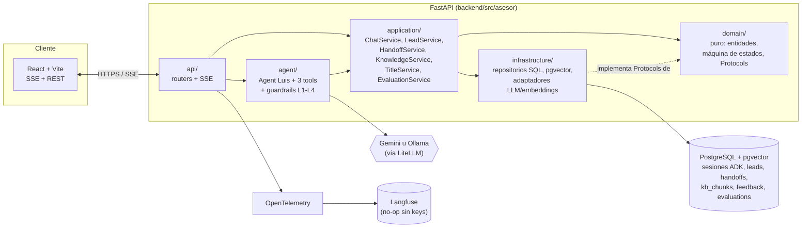
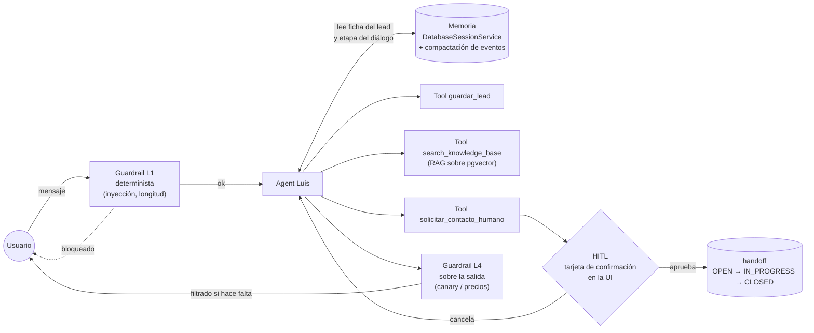
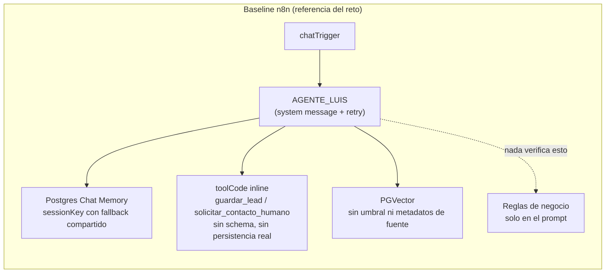
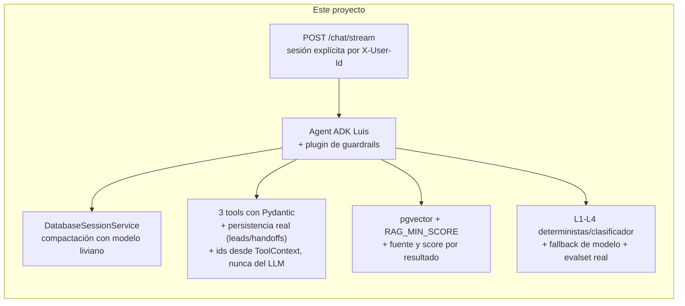

# Asesor automotriz virtual

Migración de un workflow de n8n a un backend propio con **Google ADK 2.x + FastAPI + React**: un agente conversacional ("Luis") que orienta a un cliente en la compra de un auto — sin asociarse a marcas ni a sistemas de financiamiento específicos — con captura de leads, derivación asistida a un humano (HITL), consulta a una base de conocimiento (RAG) y guardrails en capas.

**Corre sin ninguna API key**: el perfil por defecto usa modelos locales vía Ollama, empaquetados en el mismo `docker-compose.yml`. Gemini sigue disponible como alternativa cambiando dos variables de entorno.

## Índice

- [Características](#características)
- [Arquitectura](#arquitectura)
- [Qué cambia respecto al baseline de n8n](#qué-cambia-respecto-al-baseline-de-n8n)
- [Quick start](#quick-start)
- [Estructura del proyecto](#estructura-del-proyecto)
- [Comandos](#comandos)
- [Tests y evaluación](#tests-y-evaluación)
- [Documentación](#documentación)
- [Demo](#demo)
- [Estado del proyecto](#estado-del-proyecto)

## Características

- **Agente conversacional** ("Luis") con voz e instrucción propias, en español de Perú, tuteando — construido sobre `google-adk` (`Agent`/`Runner`/`App`), no un scaffold genérico.
- **3 tools con contrato propio** (spec 03): `guardar_lead` (captura estructurada del lead), `solicitar_contacto_humano` (deriva a un humano con confirmación previa) y `search_knowledge_base` (RAG sobre una base de conocimiento automotriz general).
- **Human-in-the-loop real**: pedir un test drive o una cotización formal pausa el turno con una tarjeta de confirmación en la UI antes de crear un ticket — no un `JSON.stringify` que no llega a nadie.
- **RAG con umbral y fuente**: `pgvector` sobre el mismo Postgres, ingesta idempotente por hash, y una frase honesta cuando no hay dato ("no tengo el detalle exacto, pero anoto para que un especialista te lo confirme") en vez de inventar.
- **Guardrails en capas** (spec 07): L1 determinista (inyección de prompt, longitud, caracteres invisibles) sin llamar al modelo, L3 sobre cada tool call, L4 sobre la salida (fuga de un token canario, precios/cotizaciones/stock nunca llegan al usuario). L2 (clasificador con fail-open) queda diseñado pero no implementado — P1, no bloqueaba los AT del reto.
- **Fallbacks de infraestructura**: backoff + modelo de respaldo si el principal falla, degradación honesta si la KB o la base de datos no responden — nunca un stack trace en pantalla.
- **Observabilidad real**: OpenTelemetry → Langfuse (no-op sin keys, la app funciona igual), traza completa por turno, feedback 👍/👎, y evaluación de calidad post-turno en background con un LLM juez.
- **Golden dataset de conversaciones** (`backend/tests/evalset/`): casos on-topic y fuera de guion (inyección de prompt, pedido de precio, fondos colectivos) corridos contra el modelo real, no simulados.
- **Modelos locales de verdad, no una demo**: catálogo de Ollama descubierto en vivo (nunca declarado a mano), selector de modelo por turno en la UI, capacidades reales (razonamiento/tools) mostradas como íconos.
- **Frontend propio** en React + Vite + TypeScript estricto + Tailwind (shadcn/ui), tipado de extremo a extremo desde el OpenAPI del backend.

## Arquitectura

### Por qué Google ADK

`google-adk` da `Runner`, `DatabaseSessionService` (memoria por sesión sobre Postgres) y confirmación de tools nativa (HITL) sin reinventar esa infraestructura, y separa el núcleo decisional de la UI — el requisito explícito del reto. Se evaluó LangGraph y se descartó por mayor esfuerzo de integración con Postgres y HITL para el alcance y plazo disponibles; mantener n8n se descartó por no cumplir "desacoplado de la UI" ni permitir tests ni observabilidad de grado producción. Detalle completo y trade-offs en [`specs/decisions/ADR-001-framework.md`](specs/decisions/ADR-001-framework.md).

### Vista de componentes



**Regla de dependencia:** `api → application → domain ← infrastructure`. `domain/` no importa ADK, FastAPI ni SQLAlchemy — es código puro, testeable sin red. `agent/` depende de `application/`, nunca al revés: las tools son adaptadores delgados. Detalle completo, trade-offs y qué revisar si escala en [`specs/01-architecture.md`](specs/01-architecture.md).

### Flujo de un turno (memoria, tools, HITL y guardrails)



## Qué cambia respecto al baseline de n8n





| Brecha del baseline (detalle en [`specs/00-baseline-analysis.md`](specs/00-baseline-analysis.md)) | Cómo se cerró |
|---|---|
| `sessionKey` con fallback `'session_default'`: conversaciones sin id comparten memoria entre usuarios | Sesión creada explícitamente por el backend, sin fallback compartido |
| Tools sin schema, "guardado" en memoria del propio nodo, ticket con `Math.random()` | Pydantic estricto, persistencia real en Postgres, ids por PK de base de datos |
| `session_id` expuesto como argumento que el LLM debía rellenar | `session_id`/`user_id` llegan por `ToolContext`, nunca del LLM |
| Handoff sin ciclo real: el "ticket" nunca llega a nadie | Confirmación de tools + tabla `handoffs` con estados y endpoints admin |
| Guardrails solo por prompt, sin capa determinista | L1-L4: determinista, clasificador, sobre tools, y sobre la salida |
| RAG sin umbral ni ingesta gobernada; memoria sin compactación ni trazas | `RAG_MIN_SCORE`, ingesta idempotente, `EventsCompactionConfig` afinado, OTel + Langfuse |
| Modelos de Vertex AI ya descontinuados hardcodeados | IDs solo por env, verificados contra documentación vigente; además, perfil 100% local sin API key |

## Quick start

Requiere Docker y Docker Compose. Nada más — el perfil por defecto no necesita ninguna API key.

```bash
git clone <este-repositorio>
cd asesor
cp .env.example .env
docker compose up -d
```

La primera vez tarda lo que tarden las descargas de los modelos de Ollama (varios GB); el volumen los conserva entre reinicios, así que arranques posteriores son instantáneos. Cuando `docker compose ps` muestre los 4 servicios `healthy`:

- Frontend: <http://localhost:5190>
- Backend (OpenAPI): <http://localhost:8090/docs>

Para usar Gemini en vez de los modelos locales, cambia `LLM_PROVIDER=gemini` y `EMBEDDINGS_PROVIDER=gemini` en `.env`, agrega tu `GOOGLE_API_KEY` (ver el comentario en `.env.example` para el resto de variables del perfil) y vuelve a levantar el backend.

Puertos por defecto (**8090** backend, **5190** frontend, **5490** Postgres) elegidos fuera de los habituales a propósito, para convivir con otros proyectos en la misma máquina — configurables por `BACKEND_PORT`/`FRONTEND_PORT`/`POSTGRES_PORT`.

## Estructura del proyecto

```
backend/src/asesor/
├── api/              # Routers FastAPI, DTOs, SSE, manejo de errores
├── application/      # Casos de uso: ChatService, LeadService, HandoffService,
│                     # KnowledgeService, TitleService, EvaluationService
├── domain/           # Entidades y máquina de estados puras, Protocols
├── agent/            # Agent ADK "Luis", las 3 tools, guardrails L1-L4
└── infrastructure/   # Repositorios SQLAlchemy, pgvector, adaptadores
                      # de LLM/embeddings, telemetría, fault injection

backend/tests/
├── unit/             # Dominio y aplicación, sin red
├── integration/      # API + Postgres real, FakeLlm
├── acceptance/        # Los AT de specs/09
└── evalset/           # Golden dataset de conversaciones contra el modelo real

frontend/src/
├── features/         # chat, sesiones, HITL, panel dev
├── components/ui/    # shadcn/ui
└── api/              # Cliente tipado desde el OpenAPI del backend

specs/                # Fuente de verdad del diseño (00-11, decisions/, notes/)
docs/                 # UI, guion de pruebas manuales, guion de demo
kb/                   # Documentos fuente de la base de conocimiento (RAG)
```

## Comandos

`make` no está instalado en Windows; estos son los equivalentes directos (`Makefile` es la interfaz canónica en CI/Linux/macOS):

```bash
cd backend && uv run ruff check . && uv run ruff format --check .   # lint
cd backend && uv run mypy                                          # typecheck
cd backend && uv run pytest                                        # tests (191, excluye live/evalset)
cd backend && uv run pytest tests/evalset -m evalset                # golden dataset contra el modelo real (~4 min)
cd frontend && npm run typecheck && npm run build                  # frontend
cd backend && uv run python scripts/ingest_kb.py                   # (re)ingesta de la KB
docker compose up -d                                                # levanta todo, recarga en caliente
```

## Tests y evaluación

- **191 tests de backend** (unit, integration, acceptance) + tests de frontend (vitest), mypy strict y ruff limpios.
- **Tests de aceptación** (`backend/tests/acceptance/`) cubren los AT de [`specs/09-acceptance-tests.md`](specs/09-acceptance-tests.md): saludo, captura de lead, anti-loop, RAG, HITL (confirmar/cancelar/idempotencia), guardrails y fallbacks.
- **Evalset** (`backend/tests/evalset/luis.cases.json`): conversaciones on-topic y fuera de guion corridas contra el modelo real con dos mecanismos — trayectoria de tools (determinista) y un juez LLM contra reglas en español. Editable a mano, sin tocar código.
- **`docs/pruebas-manuales.md`**: guion para probar a mano en el navegador, con qué esperar en espíritu (no texto exacto — un LLM no responde siempre igual), incluyendo el flujo HITL completo.

## Documentación

| Pregunta | Dónde |
|---|---|
| Specs completas (arquitectura, contrato de API, tools, guardrails, etc.) | [`specs/`](specs/) — índice en [`CLAUDE.md`](CLAUDE.md) |
| Decisiones de diseño (por qué ADK, HITL, modelos locales) | [`specs/decisions/`](specs/decisions/) |
| Firmas de ADK verificadas contra el paquete instalado | [`specs/notes/adk-api.md`](specs/notes/adk-api.md) |
| Checklist de fases y hallazgos de cada ronda | [`PROGRESS.md`](PROGRESS.md) |
| Guion de pruebas manuales | [`docs/pruebas-manuales.md`](docs/pruebas-manuales.md) |
| Guion de la demo grabada | [`docs/demo-script.md`](docs/demo-script.md) |

## Demo

Video (5-7 min): _pendiente de grabar y enlazar — ver [`docs/demo-script.md`](docs/demo-script.md)._

## Estado del proyecto

Fases F0–F9 del plan de construcción — detalle y hallazgos de cada una en [`PROGRESS.md`](PROGRESS.md). Reto técnico (AI Engineer) con entrega viernes 18-sep-2026.
