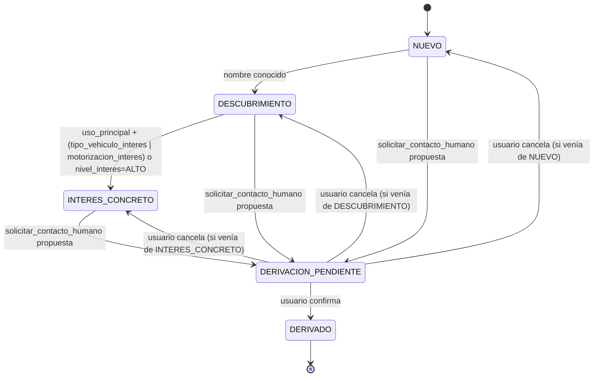

# 04 · Estados del diálogo

La etapa vive en el dominio (no la decide el LLM) y se recalcula cada vez que cambia el lead o se ejecuta una tool relevante. Se persiste junto al estado de sesión (spec 06) y se expone en `lead.updated` (spec 02).

## 1. Diagrama

Solo avanza, salvo la cancelación de `DERIVACION_PENDIENTE`, que vuelve a la etapa previa exacta (se guarda `etapa_previa` al entrar a `DERIVACION_PENDIENTE`). No hay retroceso desde `DERIVADO`.

**Monotonía (aclarado en F2).** La máquina es monótona: recalcula la etapa derivada del lead y se queda con la mayor entre esa y la actual. Eso significa que puede **saltarse `DESCUBRIMIENTO`** si el usuario da uso y tipo de vehículo antes que su nombre — pasa de `NUEVO` directo a `INTERES_CONCRETO`. Es intencional: bloquear el salto dejaría el diálogo trabado en una etapa que ya no describe la conversación.

## 2. Tabla de transiciones

| # | Transición | Trigger | Guard | Acción | Tool | Evento SSE |
|---|---|---|---|---|---|---|
| 1 | `NUEVO → DESCUBRIMIENTO` | `guardar_lead` con `nombre` | `lead.nombre is not null` | recalcular etapa | `guardar_lead` | `lead.updated` |
| 2 | `DESCUBRIMIENTO → INTERES_CONCRETO` | `guardar_lead` | `uso_principal` y (`tipo_vehiculo_interes` o `motorizacion_interes`), **o** `nivel_interes = ALTO` | recalcular etapa | `guardar_lead` | `lead.updated` |
| 3 | `* → DERIVACION_PENDIENTE` | el agente propone `solicitar_contacto_humano` | ninguna etapa previa excluida | guardar `etapa_previa`; abrir confirmación | `solicitar_contacto_humano` (propuesta, aún sin ejecutar) | `hitl.confirmation_required` |
| 4 | `DERIVACION_PENDIENTE → DERIVADO` | usuario confirma | `approved = true` | ejecutar `solicitar_contacto_humano`; crear handoff `OPEN` | `solicitar_contacto_humano` (confirmada) | `lead.updated`, `tool.finished` |
| 5 | `DERIVACION_PENDIENTE → etapa_previa` | usuario cancela | `approved = false` | descartar confirmación, restaurar `etapa_previa` | — | `lead.updated` |

## 3. Banderas auxiliares

- `solo_mirando: bool` — se activa cuando el usuario dice la frase equivalente a "solo estoy mirando" (spec 05, 07 L1 no aplica aquí; es intención, no inyección). Mientras esté activa, el agente reduce preguntas proactivas pero las transiciones de etapa siguen funcionando igual si el usuario decide avanzar. Se activa vía `guardar_lead(solo_mirando=true)` — puede ir solo, sin ningún otro campo, y no cuenta como `EMPTY_UPDATE` (spec 03 §2) — que escribe `SOLO_MIRANDO_KEY` en el estado de sesión (`agent/state.py`), igual que `guardar_lead` ya escribía la etapa. Verificado en vivo contra el modelo real (F9): el mensaje "por ahora solo estoy mirando" dispara la tool, la frase canned y `GET /sessions/{id}/lead` refleja `solo_mirando: true`. AT-05 (spec 09) tiene test propio (`test_at_agent_core.py`).
- `handoff_abierto: bool` (derivada de `handoffs.status = OPEN` para la sesión) — si ya es `true` y el agente detecta un nuevo motivo de derivación, `solicitar_contacto_humano` es idempotente (spec 03 §3) y la etapa permanece en `DERIVADO`, no hay segunda `DERIVACION_PENDIENTE`.

## 4. Notas de implementación

- La máquina de estados vive en `domain/` como función pura `next_stage(current: Stage, lead: Lead) -> Stage` (`domain/stages.py`), sin dependencias externas — testeable con `FakeLlm` ausente por completo (no necesita LLM). No recibe un `event` explícito: la etapa siguiente se deriva del propio `Lead` resultante.
- El `Agent` ADK nunca escribe la etapa; solo la lee (inyectada en la instrucción, spec 05) y la observa en el resultado de las tools.
- Confirmación de `DERIVACION_PENDIENTE`: ver spec 03 §3 y ADR-002 para el mecanismo primario (confirmación nativa de tools ADK) y el fallback (`pending_confirmation` en estado + confirmación por UI).
